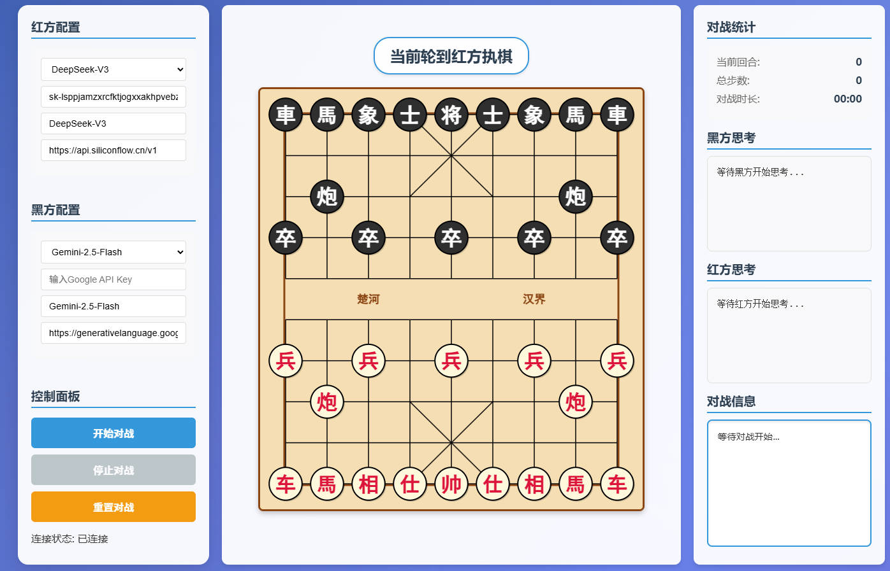

# AI中国象棋对战系统

一个基于大语言模型的中国象棋AI对战平台，支持多种主流AI模型进行实时象棋对局。


<div align="center">、
  <h4>
    <a href="README.md">🇨🇳 中文</a>
    <span> | </span>
    <a href="README_EN.md">🇬🇧 English</a>
  </h4>
</div>


## 🎯 项目特色

- **多模型支持**：集成DeepSeek、Gemini、Qwen等多种大语言模型
- **实时对战**：基于Socket.IO的实时通信，支持流式思考过程展示
- **智能棋步**：AI模型从合法棋步中选择，避免无效移动
- **美观界面**：现代化Web界面，支持棋盘可视化和思考过程展示
- **自动重试**：内置重试机制，确保对战稳定进行

## 🏗️ 效果演示

[](https://www.bilibili.com/video/BV1M9thzRE56)

## 🚀 快速开始

### 环境要求

- Python 3.8+
- Flask
- Flask-SocketIO
- requests
- google-genai

### 安装依赖

```bash
uv sync
```

### 启动应用

```bash
python app.py
```

访问 `http://localhost:5003` 开始使用。

## 🎮 使用说明

### 1. 选择AI模型

- **红方**：支持DeepSeek-V3、Qwen等模型
- **黑方**：支持Gemini等模型

### 2. 开始对战

1. 在界面上选择红方和黑方的AI模型
2. 点击"开始对战"按钮
3. 观看AI实时思考和下棋过程

### 3. 功能特性

- **实时思考展示**：查看AI的思考过程和策略分析
- **棋步历史**：完整的对局记录和棋步回放
- **自动滚动**：游戏信息自动滚动到最新内容
- **错误处理**：智能重试机制，处理API超时和无效棋步

## 🔧 技术架构

### 后端技术栈

- **Flask**：Web框架
- **Flask-SocketIO**：实时通信
- **Python**：核心逻辑实现

### 前端技术栈

- **HTML5/CSS3**：界面布局和样式
- **JavaScript**：交互逻辑
- **Socket.IO Client**：实时通信

### AI模型集成

- **SiliconFlow API**：统一的模型调用接口
- **流式输出**：支持实时思考过程展示
- **多模型适配**：兼容不同API格式

## 🎯 核心功能

### AI玩家系统 (`models/llm_player.py`)

- 支持多种AI模型的统一接口
- 流式思考过程输出
- 智能提示词构建，包含合法棋步列表
- 自动解析AI响应并提取棋步

### 象棋游戏引擎 (`models/chess_game.py`)

- 完整的中国象棋规则实现
- 合法棋步生成和验证
- 游戏状态管理
- 棋盘可视化

### 对战管理系统 (`models/battle.py`)

- 对战流程控制
- 棋步记录和历史管理
- 游戏结果统计

### 实时通信 (`app.py`)

- Socket.IO事件处理
- 后台任务管理
- 错误处理和重试机制

## 🛠️ 开发说明

### 添加新的AI模型

1. 在 `models/llm_player.py` 中添加新的API调用方法
2. 在 `templates/index.html` 中添加模型选项
3. 更新 `static/js/chess.js` 中的模型配置

### 自定义棋盘样式

修改 `static/css/style.css` 中的相关样式类：

- `.chess-board` - 棋盘容器
- `.chess-piece` - 棋子样式
- `.thinking-content` - 思考框样式
